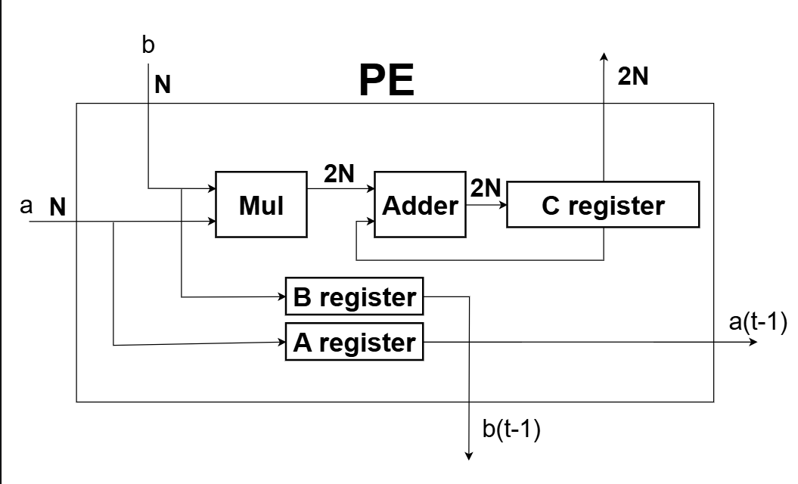
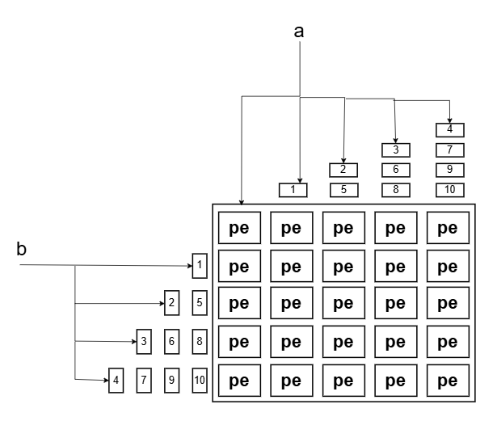
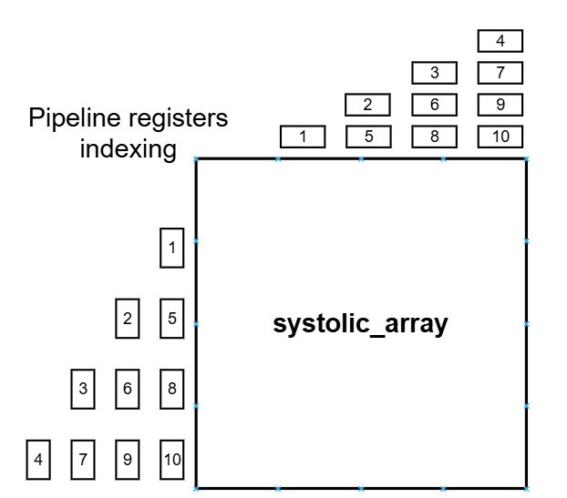
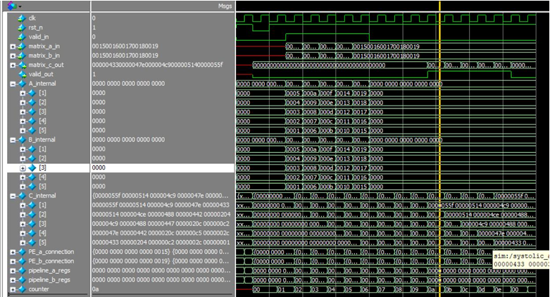

# Systolic Array Implementation Report

**Student Name:** Abdullah Omar Elazhary   

---

## Architecture

### Detailed Architecture Diagram



The Processing Element (PE) is the basic building block of our systolic array. Each PE contains:

- **Multiplier:** Computes A × B  
- **Adder:** Adds multiplication result to accumulated value  
- **C Register:** Stores the accumulated result (partial sum)  
- **A Register:** Delays input A by one clock cycle for next PE  
- **B Register:** Delays input B by one clock cycle for next PE

  

---

The 5×5 systolic array consists of 25 PEs arranged in a grid. Data flows as follows:

- Matrix A elements enter from the left and flow horizontally  
- Matrix B elements enter from the top and flow vertically  
- Each PE accumulates partial products to compute one element of result matrix C  

 

Pipeline registers are used to properly align the timing of matrix elements. The indexing ensures that corresponding A and B elements arrive at each PE simultaneously.

---

## Operation Explanation

The systolic array performs matrix multiplication:

```text
C = A × B
```

### Steps:

1. **Input Phase:** Matrix elements are fed into the array with proper timing  
2. **Processing Phase:** Each PE performs multiply-accumulate operations  
3. **Accumulation:** Partial products accumulate in each PE’s C register  
4. **Output Phase:** Final results are read after sufficient clock cycles  

The array requires:

- **Latency:** `2 × N_SIZE` clock cycles before first result  
- **Throughput:** One result row per clock cycle afterward  

---

## Code Implementation

### Processing Element Module

```verilog
module PE #(parameter DATAWIDTH)(  
  input clk, rst,  
  input [DATAWIDTH-1 : 0] A, B,  
  output [(2 * DATAWIDTH)-1 : 0] C,  
  output [DATAWIDTH-1 : 0] A_out, B_out  
);
```

The PE implements multiply-accumulate with registered outputs for pipeline operation.

---

### Systolic Array Module

```verilog
module systolic_array #(parameter DATAWIDTH, parameter N_SIZE)(  
  input clk, rst_n, valid_in,  
  input [(N_SIZE * DATAWIDTH)-1 : 0] matrix_a_in, matrix_b_in,  
  output [(N_SIZE * 2 * DATAWIDTH)-1 : 0] matrix_c_out,  
  output valid_out  
);
```

The top-level module instantiates 25 PEs and manages data flow using generate blocks.

---

### Pipeline Register Management

```verilog
reg [DATAWIDTH-1 : 0] pipeline_a_regs [1 : (N_SIZE * N_SIZE - N_SIZE) / 2];  
reg [DATAWIDTH-1 : 0] pipeline_b_regs [1 : (N_SIZE * N_SIZE - N_SIZE) / 2];
```

Pipeline registers provide necessary delays to align matrix data timing.

---

## Simulation Results

### Testbench Design

 

The testbench includes three levels of testing:

1. Individual PE Testing  
2. PE Network Testing  
3. Complete Array Testing (5×5 matrix multiplication)  

---

### Log File Results

#### Input Phase (Time 35000–75000)

```text
[Time 35000] valid_in = 1 | valid_out = 0
matrix_a_in: 5 4 3 2 1  
matrix_b_in: 5 4 3 2 1
```

#### Output Phase (Time 125000–165000)

```text
[Time 125000] valid_in = 0 | valid_out = 1
matrix_c_out: 1375 1300 1225 1150 1075
```

---

## Final Matrix Results

### Matrix A

```text
Row 0: 5  10  15  20  25
Row 1: 4   9  14  19  24
Row 2: 3   8  13  18  23
Row 3: 2   7  12  17  22
Row 4: 1   6  11  16  21
```

### Matrix B

```text
Row 0: 5   4   3   2   1
Row 1: 10  9   8   7   6
Row 2: 15 14  13  12  11
Row 3: 20 19  18  17  16
Row 4: 25 24  23  22  21
```

### Result Matrix C

```text
Row 0: 1375 1300 1225 1150 1075
Row 1: 1300 1230 1160 1090 1020
Row 2: 1225 1160 1095 1030  965
Row 3: 1150 1090 1030  970  910
Row 4: 1075 1020  965  910  855
```

---

## Verification

The testbench automatically verifies results by:

- Computing expected values  
- Comparing with actual outputs  

All test cases passed successfully.

---

## Synthesis Results

### Timing Results (Quartus)

| Parameter         | Setup (ns) | Hold (ns) | Recovery (ns) | Removal (ns) |
|------------------|-----------|----------|---------------|-------------|
| Worst-case Slack | 11.829    | 0.174    | 17.412        | 0.927       |
| Design-wide TNS  | 0.0       | 0.0      | 0.0           | 0.0         |

All timing requirements met with positive slack margins.

---

### Clock-to-Output Timing

| Signal        | Rise (ns) | Fall (ns) |
|--------------|----------|----------|
| valid_out     | 10.892   | 10.907   |
| matrix_c_out  | ~12–13   | ~12–13   |

---

### Resource Utilization

| Resource     | Used | Notes                  |
|-------------|------|------------------------|
| Logic Cells | 1466 | Combinational logic    |
| Registers   | 1676 | Pipeline & storage     |
| DSP 18x18   | 25   | One per PE (optimal)   |
| Memory Bits | 96   | Minimal usage          |

---

### Key Results

- Perfect timing closure with 11.8ns setup slack  
- Optimal DSP usage: 25 multipliers  
- Efficient pipelining  
- High operating frequency capability  

---

## Challenges and Solutions

### Challenge 1: Data Timing Alignment

**Problem:**  
Matrix elements must arrive at each PE at the correct time.

**Solution:**  
Pipeline registers with calculated delays:

```verilog
pipeline_a_regs[N_SIZE * (i - 2) - (((i - 1) * (i - 2)) / 2 - 1)]
```

---

### Challenge 2: PE Interconnection

**Problem:**  
Connecting 25 PEs is complex.

**Solution:**  
Used generate blocks with categories:

- Corner PE  
- First row PEs  
- First column PEs  
- Internal PEs  

---

### Challenge 3: Output Control

**Problem:**  
Determining when valid results are available.

**Solution:**  
Counter-based system with latency = `2 × N_SIZE`.

---

### Challenge 4: Parametrization

**Problem:**  
Scalability for different matrix sizes.

**Solution:**  
Parameterized design:

- `DATAWIDTH = 16`  
- `N_SIZE = 5`  

---

## Design Features

- Parametrizable design  
- Proper reset and clock handling  
- Pipeline registers for data alignment  
- Generate blocks for scalable PE instantiation  
- Comprehensive testbench  

---

## Conclusion

The implementation successfully demonstrates a fully functional **5×5 systolic array** for matrix multiplication, meeting all requirements.